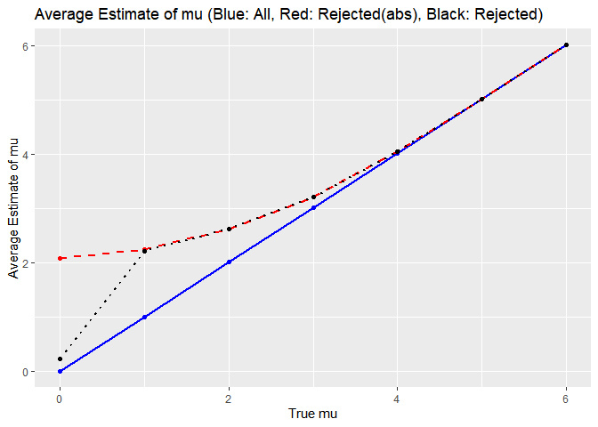

HW5
================
2024-11-13

    ## ── Attaching core tidyverse packages ──────────────────────── tidyverse 2.0.0 ──
    ## ✔ dplyr     1.1.4     ✔ readr     2.1.5
    ## ✔ forcats   1.0.0     ✔ stringr   1.5.1
    ## ✔ ggplot2   3.5.1     ✔ tibble    3.2.1
    ## ✔ lubridate 1.9.3     ✔ tidyr     1.3.1
    ## ✔ purrr     1.0.2     
    ## ── Conflicts ────────────────────────────────────────── tidyverse_conflicts() ──
    ## ✖ dplyr::filter() masks stats::filter()
    ## ✖ dplyr::lag()    masks stats::lag()
    ## ℹ Use the conflicted package (<http://conflicted.r-lib.org/>) to force all conflicts to become errors

# Problem 1

``` r
duplicate = function(n) {
  birthday = sample(1:365, n, replace = TRUE)
  return(length(birthday) != length(unique(birthday)))
}
```

I will first write a function that randomly assigns n number of people a
birthday. Then checks the if a person has a same birthday and show a
result.

True: there is duplicate birthday False: there aren’t any duplicate
birthday

``` r
group_sizes = 2:50
probabilities = numeric(length(group_sizes))
```

Have a group sizes 2 through 50. Make a variable that records the
probabilities for each group.

``` r
for (i in 1:length(group_sizes)) {
  groups = group_sizes[i]
  
  results = replicate(10000, duplicate(groups))
  
  probabilities[i] = mean(results)
}
```

Make a function that run the simulation for each group size and run the
simulation 10000 times for each group and calculate the probability of
at least one duplicate birthday.

``` r
data = data_frame(GS = group_sizes, P = probabilities)
```

    ## Warning: `data_frame()` was deprecated in tibble 1.1.0.
    ## ℹ Please use `tibble()` instead.
    ## This warning is displayed once every 8 hours.
    ## Call `lifecycle::last_lifecycle_warnings()` to see where this warning was
    ## generated.

``` r
ggplot(data, aes(x = GS, y = P)) +
  geom_smooth() +
  geom_point() +
  labs(
    title = "Probability vs. Group Size",
    x = "Group Size",
    y = "Probability of Duplicate Birthday"
  ) +
  theme_minimal()
```

    ## `geom_smooth()` using method = 'loess' and formula = 'y ~ x'

<!-- -->

It shows a increasing curve as group size increases the probability
increases.

# Problem 2

``` r
mus = 0:6
alpha = 0.05

# Data storage
results = data.frame()
```

I’ve set the parameters and storage for the results.

``` r
for (mu in mus) {
  for (i in 1:5000) {
    
    sample_data = rnorm(30, mean = mu, sd = 5)
    
    t_test = broom::tidy(t.test(sample_data, mean = 0))
    
    results = rbind(results, data.frame(
      mu_true = mu,
      mu_hat = mean(sample_data),
      p_value = t_test$p.value,
      rejected = t_test$p.value < alpha
    ))
  }
}

power_results = results |> 
  group_by(mu_true) |> 
  summarize(power = mean(rejected))

estimated_results = results |> 
  group_by(mu_true) |> 
  summarize(avg_mu_hat = mean((mu_hat)),
            avg_mu_hat_rejected = mean(abs(mu_hat[rejected])))
```

Then, run a loop that will conduct the t-test with the null hypothesis
of mu = 0. Each iteration, it will test 5000 times with sample data with
n = 30, standard deviation = 5, consists of random mean that is from
true mean of 0 through 6. Then I made 2 data frame that calculates power
and another data frame that has average of all sample mean and average
of the rejected mean by their true mean. I made the mu_hat average to be
absolute value because negative values could even out the numbers to be
closer to true mu, therefore hard to see true parameters of the mean
rejected values.

``` r
ggplot(power_results, aes(x = mu_true, y = power)) +
  geom_line() +
  geom_point() +
  labs(x = "True mu", y = "Power", title = "Power vs. Effect Size (True mu)")
```

<!-- -->

The graph shows that as effect size increases, the power increases. This
makes sense because there will be a higher chance of the null hypothesis
(mu = 0) of the t-test being rejected if the true mean of the sample
increases.It shows the highest increase between the true mean of 1 to 3.

``` r
ggplot(estimated_results, aes(x = mu_true)) +
  geom_line(aes(y = avg_mu_hat), color = "blue", linetype = "solid", size = 1) +
  geom_point(aes(y = avg_mu_hat), color = "blue") +
  geom_line(aes(y = avg_mu_hat_rejected), color = "red", linetype = "dashed", size = 1) +
  geom_point(aes(y = avg_mu_hat_rejected), color = "red") +
  labs(x = "True mu", y = "Average Estimate of mu",
       title = "Average Estimate of mu (Blue: All, Red: Rejected)")
```

    ## Warning: Using `size` aesthetic for lines was deprecated in ggplot2 3.4.0.
    ## ℹ Please use `linewidth` instead.
    ## This warning is displayed once every 8 hours.
    ## Call `lifecycle::last_lifecycle_warnings()` to see where this warning was
    ## generated.

<!-- -->

The red dashed line shows the sample average that rejected the t-test by
their true average.

z-value equation for sample size bigger than or equal to 30: z = (x-mu)
/ (sigma/sqrt(n))

For alpha = 0.05 for two tailed test, if the z-value exceeds 1.96, they
reject the null hypothesis. If we apply this concept to the result of
the graph, it explains the graph. You could see all the rejected mean
values all exceed 1.96. We can see the sample average of mu_hat across
the test for which the null is rejected approximately equal to the true
value of mu starting from True_mu = 2.

# Problem 3

``` r
homicide_data = read_csv("homicide-data.csv") |> 
  mutate(city_state = paste(city, state, sep = ", "))
```

    ## Rows: 52179 Columns: 12
    ## ── Column specification ────────────────────────────────────────────────────────
    ## Delimiter: ","
    ## chr (9): uid, victim_last, victim_first, victim_race, victim_age, victim_sex...
    ## dbl (3): reported_date, lat, lon
    ## 
    ## ℹ Use `spec()` to retrieve the full column specification for this data.
    ## ℹ Specify the column types or set `show_col_types = FALSE` to quiet this message.

``` r
homicide = homicide_data |> 
  group_by(city_state) |> 
  summarize(
    total_homicides = n(),
    unsolved_homicides = sum(disposition %in% c("Closed without arrest", "Open/No arrest"))
  )

baltimore = homicide |> 
  filter(city_state == "Baltimore, MD")

baltimore_prop_test = broom::tidy(prop.test(baltimore$unsolved_homicides, baltimore$total_homicides))

baltimore_estimate = baltimore_prop_test |> 
  select(estimate, conf.low, conf.high)

city_proportions = homicide |> 
  mutate(
    prop_test = map2(unsolved_homicides, total_homicides, ~ prop.test(.x, .y) |> 
                       broom::tidy())
  ) |>  
  unnest(prop_test) |> 
  select(city_state, estimate, conf.low, conf.high) |> 
  arrange(desc(estimate))
```

    ## Warning: There was 1 warning in `mutate()`.
    ## ℹ In argument: `prop_test = map2(...)`.
    ## Caused by warning in `prop.test()`:
    ## ! Chi-squared approximation may be incorrect

``` r
ggplot(city_proportions, aes(x = reorder(city_state, estimate), y = estimate)) +
  geom_point() +
  geom_errorbar(aes(ymin = conf.low, ymax = conf.high), width = 0.2) +
  labs(
    title = "Proportion of Unsolved Homicides by City",
    x = "City, State",
    y = "Proportion of Unsolved Homicides"
  ) +
  coord_flip() +
  theme_minimal()
```

<!-- -->
